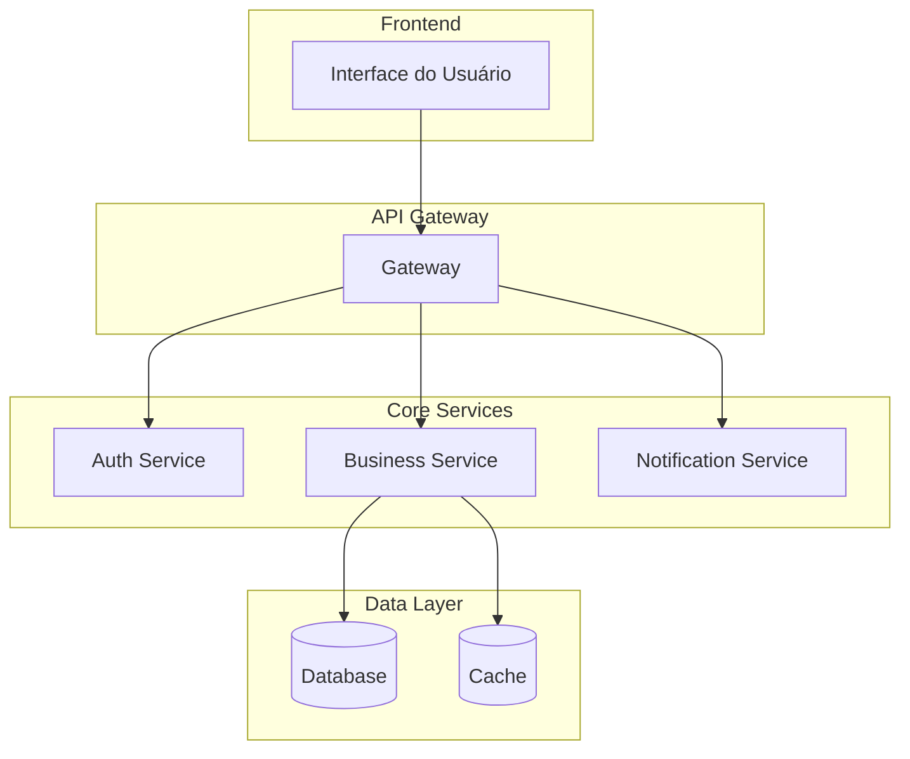
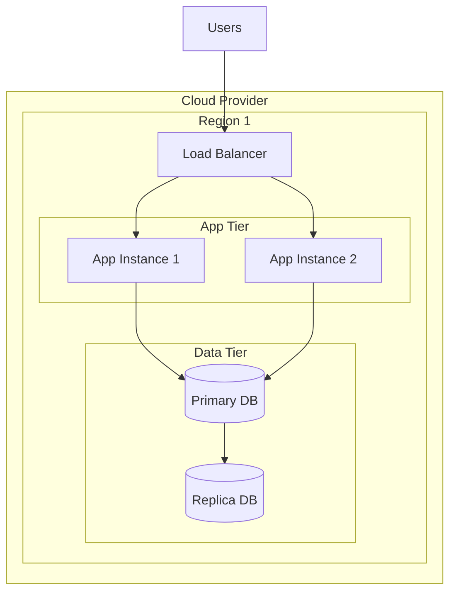
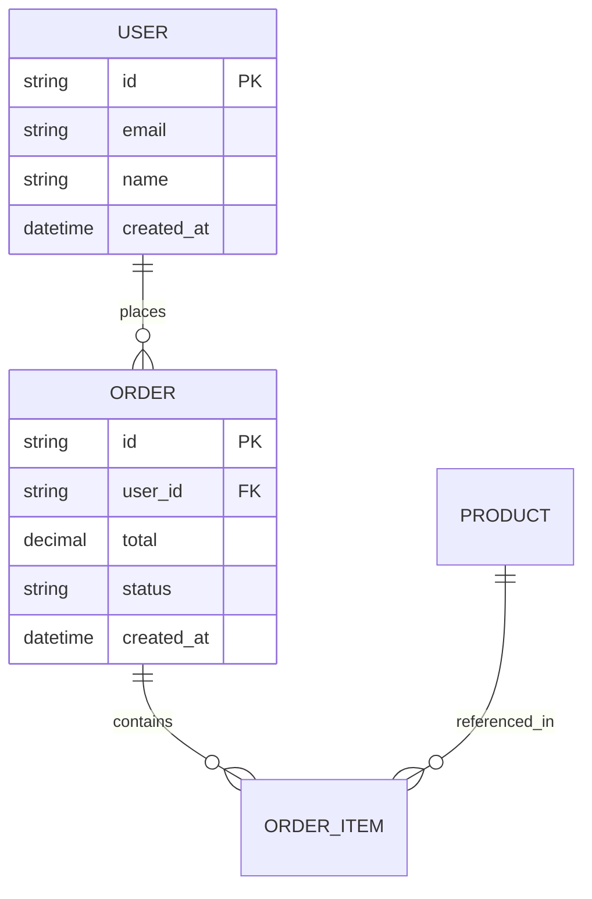

# Documento de Arquitetura de Software
**Sistema:** [Nome do Sistema]  
**Versão:** 1.0  
**Data:** [Data]  
**Arquiteto:** [Nome]  
**Stakeholders:** [Lista de stakeholders]

---

## 📋 Índice

1. [Visão Geral](#1-visão-geral)
2. [Contexto e Escopo](#2-contexto-e-escopo)
3. [Requisitos](#3-requisitos)
4. [Decisões Arquiteturais (ADRs)](#4-decisões-arquiteturais-adrs)
5. [Visão Lógica](#5-visão-lógica)
6. [Visão Física](#6-visão-física)
7. [Visão de Dados](#7-visão-de-dados)
8. [Visão de Segurança](#8-visão-de-segurança)
9. [Visão de Observabilidade](#9-visão-de-observabilidade)
10. [Padrões e Práticas](#10-padrões-e-práticas)
11. [Qualidade e Métricas](#11-qualidade-e-métricas)
12. [Riscos e Mitigações](#12-riscos-e-mitigações)
13. [Evolução e Roadmap](#13-evolução-e-roadmap)
14. [Anexos](#14-anexos)

---

## 1. Visão Geral

### 1.1 Propósito do Documento
Este documento descreve a arquitetura do sistema [Nome], fornecendo uma visão abrangente para desenvolvedores, operações e stakeholders.

### 1.2 Resumo Executivo
- **Problema:** [Descrição do problema que o sistema resolve]
- **Solução:** [Visão de alto nível da solução]
- **Benefícios:** [Principais benefícios esperados]
- **Tecnologias:** [Stack principal]

### 1.3 Princípios Arquiteturais
- [ ] **Simplicidade:** Preferir soluções simples e diretas
- [ ] **Escalabilidade:** Projetar para crescimento horizontal
- [ ] **Resiliência:** Tolerar falhas e se recuperar rapidamente
- [ ] **Observabilidade:** Ser transparente e monitorável
- [ ] **Segurança:** Segurança por design
- [ ] **Manutenibilidade:** Código limpo e bem estruturado

---

## 2. Contexto e Escopo

### 2.1 Contexto do Negócio
- **Domínio:** [Ex: E-commerce, Fintech, Saúde]
- **Usuários:** [Perfil dos usuários]
- **Volume:** [Transações/dia, usuários simultâneos]
- **Regulamentações:** [Compliance, LGPD, etc.]

### 2.2 Escopo do Sistema
- **Inclui:** [Funcionalidades cobertas]
- **Não inclui:** [Funcionalidades fora do escopo]
- **Integrações:** [Sistemas externos]

### 2.3 Restrições
- **Tecnológicas:** [Limitações de tecnologia]
- **Orçamentárias:** [Limitações de custo]
- **Temporais:** [Prazos críticos]
- **Regulatórias:** [Compliance obrigatório]

---

## 3. Requisitos

### 3.1 Requisitos Funcionais
| ID | Descrição | Prioridade | Fonte |
|----|-----------|------------|-------|
| RF001 | [Funcionalidade 1] | Alta | [Stakeholder] |
| RF002 | [Funcionalidade 2] | Média | [Stakeholder] |

### 3.2 Requisitos Não-Funcionais
| Categoria | Requisito | Valor | Métrica |
|-----------|-----------|-------|---------|
| **Performance** | Latência | < 200ms | P95 |
| **Performance** | Throughput | > 1000 req/s | RPS |
| **Disponibilidade** | Uptime | 99.9% | SLA |
| **Escalabilidade** | Usuários simultâneos | 10.000 | Concurrent users |
| **Segurança** | Autenticação | OAuth 2.0 | Standard |
| **Observabilidade** | Tempo de detecção | < 5min | MTTD |

---

## 4. Decisões Arquiteturais (ADRs)

### 4.1 ADR-001: Escolha da Linguagem de Programação
**Status:** Aceito  
**Data:** [Data]

**Contexto:** Necessidade de escolher a linguagem principal para desenvolvimento.

**Decisão:** Utilizar [Linguagem] devido a [razões específicas].

**Consequências:**
- ✅ [Benefício 1]
- ✅ [Benefício 2]
- ❌ [Limitação 1]

**Alternativas consideradas:**
- [Alternativa 1]: Rejeitada por [motivo]
- [Alternativa 2]: Rejeitada por [motivo]

### 4.2 ADR-002: Padrão Arquitetural
**Status:** Aceito  
**Data:** [Data]

**Contexto:** Definir a estrutura arquitetural do sistema.

**Decisão:** Adotar [Clean Architecture/Hexagonal/Microserviços] porque [justificativa].

---

## 5. Visão Lógica

### 5.1 Diagrama de Alto Nível

### 5.2 Camadas da Aplicação
- **Presentation Layer:** [Responsabilidades]
- **Application Layer:** [Responsabilidades]
- **Domain Layer:** [Responsabilidades]
- **Infrastructure Layer:** [Responsabilidades]

### 5.3 Componentes Principais
| Componente | Responsabilidade | Dependências |
|------------|------------------|--------------|
| [Componente 1] | [Descrição] | [Lista] |
| [Componente 2] | [Descrição] | [Lista] |

---

## 6. Visão Física

### 6.1 Topologia de Deploy

### 6.2 Especificações de Infraestrutura
| Componente | Especificação | Quantidade | Justificativa |
|------------|---------------|------------|---------------|
| App Servers | 4 vCPU, 8GB RAM | 3 | [Justificativa] |
| Database | 8 vCPU, 32GB RAM | 1 | [Justificativa] |
| Cache | 2 vCPU, 4GB RAM | 2 | [Justificativa] |

### 6.3 Estratégia de Deploy
- **Ambiente:** [Dev/Staging/Prod]
- **Método:** [Blue-Green/Canary/Rolling]
- **CI/CD:** [Pipeline description]

---

## 7. Visão de Dados

### 7.1 Modelo de Dados

### 7.2 Estratégia de Persistência
- **Primary Database:** [Tipo e justificativa]
- **Caching Strategy:** [Estratégia de cache]
- **Data Migration:** [Estratégia de migração]

### 7.3 Padrões de Acesso a Dados
- **Repository Pattern:** Para abstração de persistência
- **Unit of Work:** Para transações
- **CQRS:** Para separação de leitura/escrita

---

## 8. Visão de Segurança

### 8.1 Autenticação e Autorização
- **Autenticação:** [OAuth 2.0/JWT/SAML]
- **Autorização:** [RBAC/ABAC]
- **MFA:** [Implementação de MFA]

### 8.2 Proteção de Dados
- **Criptografia em Trânsito:** [TLS 1.3]
- **Criptografia em Repouso:** [AES-256]
- **Dados Sensíveis:** [Estratégia de mascaramento]

### 8.3 Compliance
- **LGPD:** [Implementações específicas]
- **PCI DSS:** [Se aplicável]
- **Auditoria:** [Logs de auditoria]

---

## 9. Visão de Observabilidade

### 9.1 Métricas de Negócio
| Métrica | Descrição | SLO | Alerta |
|---------|-----------|-----|--------|
| Taxa de Conversão | % de visitantes que convertem | > 2% | < 1.5% |
| Tempo de Resposta | Latência da API | < 200ms | > 500ms |
| Taxa de Erro | % de requests com erro | < 0.1% | > 1% |

### 9.2 Métricas Técnicas
- **Infrastructure:** CPU, Memory, Disk, Network
- **Application:** Response time, Error rate, Throughput
- **Database:** Connection pool, Query performance

### 9.3 Logging e Tracing
- **Structured Logging:** [Formato JSON]
- **Distributed Tracing:** [OpenTelemetry]
- **Log Aggregation:** [ELK Stack/Grafana Loki]

### 9.4 Alertas e Runbooks
| Alerta | Condição | Ação | Runbook |
|--------|----------|------|---------|
| High Error Rate | Error rate > 1% | PagerDuty | [Link] |
| High Latency | P95 > 500ms | Slack | [Link] |

---

## 10. Padrões e Práticas

### 10.1 Padrões de Design
| Padrão | Aplicação | Benefício |
|--------|-----------|-----------|
| Repository | Acesso a dados | Testabilidade |
| Factory | Criação de objetos | Flexibilidade |
| Observer | Eventos | Desacoplamento |

### 10.2 Padrões Arquiteturais
- **CQRS:** Para separação de leitura/escrita
- **Event Sourcing:** Para auditoria e replay
- **Saga Pattern:** Para transações distribuídas

### 10.3 Convenções de Código
- **Naming:** [Convenções de nomenclatura]
- **Structure:** [Estrutura de pastas]
- **Testing:** [Estratégia de testes]

---

## 11. Qualidade e Métricas

### 11.1 Métricas de Qualidade
| Métrica | Valor Atual | Meta | Ferramenta |
|---------|-------------|------|-----------|
| Code Coverage | 85% | 90% | SonarQube |
| Cyclomatic Complexity | 5.2 | < 5 | SonarQube |
| Duplicated Lines | 2% | < 1% | SonarQube |

### 11.2 Performance Benchmarks
- **Load Testing:** [Resultados de testes de carga]
- **Stress Testing:** [Limites identificados]
- **Capacity Planning:** [Projeções de crescimento]

---

## 12. Riscos e Mitigações

### 12.1 Riscos Técnicos
| Risco | Probabilidade | Impacto | Mitigação |
|-------|---------------|---------|-----------|
| Vendor Lock-in | Média | Alto | Multi-cloud strategy |
| Performance Degradation | Baixa | Alto | Monitoring + Auto-scaling |

### 12.2 Riscos de Negócio
| Risco | Probabilidade | Impacto | Mitigação |
|-------|---------------|---------|-----------|
| Compliance Violation | Baixa | Crítico | Regular audits |
| Data Breach | Baixa | Crítico | Security controls |

---

## 13. Evolução e Roadmap

### 13.1 Roadmap Arquitetural
| Fase | Duração | Objetivos | Entregas |
|------|---------|----------|----------|
| Fase 1 | 3 meses | MVP | Core features |
| Fase 2 | 6 meses | Escalabilidade | Performance improvements |
| Fase 3 | 9 meses | Observabilidade | Full monitoring |

### 13.2 Debt Técnico
- [ ] Refatoração do módulo X
- [ ] Migração para nova versão da biblioteca Y
- [ ] Implementação de testes de integração

---

## 14. Anexos

### 14.1 Glossário
- **API:** Application Programming Interface
- **SLA:** Service Level Agreement
- **SLO:** Service Level Objective

### 14.2 Referências
- [Link para documentação técnica]
- [Link para repositório de código]
- [Link para dashboards de monitoramento]

### 14.3 Contatos
- **Arquiteto:** [Nome e contato]
- **Tech Lead:** [Nome e contato]
- **DevOps:** [Nome e contato]

---

**Última atualização:** [Data]  
**Próxima revisão:** [Data + 3 meses]  
**Aprovado por:** [Nome do aprovador]